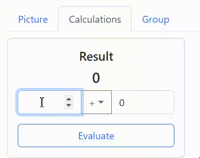
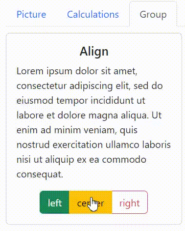

# `Task. React Testing Library`

The application has 3 tabs. 
Selecting a tab shows only the component that belongs to that tab.

## `Please, test the components of the application`

Write the tests in `src/tests`. On push, GitHub Actions checks them in two steps:

1. With the original components, every test must pass.
2. The grader replaces `src/components` with broken components and runs your tests again. `App.test.js` and `Calculations.test.js` must each have at least 2 failed tests. `ButtonGroup.test.js` must have at least 1 failed test.

Put each broken behavior in its own `test`. Extra failing tests are accepted.

### `1. App component`
Write the tests in `src/tests/App.test.js`. 
Check that:
 - the image is displayed when the Picture tab is selected
 - the Calculations component is displayed when the Calculations tab is selected
 - the ButtonGroup component is displayed when the Group tab is selected
 - a component is hidden when its tab is not active

The broken App contains 2 mistakes, so this file needs at least 2 failing tests on that version.

### `2. Calculations component`
 
Write the tests in `src/tests/Calculations.test.js`. 
Check that Evaluate produces the correct result for both addition and subtraction.

The broken Calculations component contains 2 mistakes, so this file needs at least 2 failing tests on that version. Use non-zero numbers: `0 + 0` and `0 * 0` both equal `0`, so a test with the default values does not catch a wrong addition.

### `3. ButtonGroup component`
 
Write the tests in `src/tests/ButtonGroup.test.js`. 
Check that the paragraph `align` attribute matches the selected option: left, center, or right.

The broken ButtonGroup contains 1 mistake, so at least one test in this file must fail on that version.

*The `brokenComponents` folder contains the same broken components, with the mistakes described in the files. To try the check locally, replace the files in `src/components` with these copies and run the tests again. The grader does this replacement on push; you do not need to commit the broken files.*
